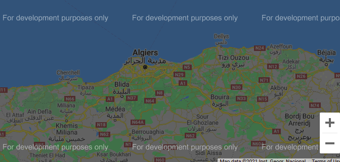

# Leaflet plain Javascript webmapping example

This project illustrate how to use Leaflet with plain Javascript code to add a Map with Points of interests in your website. This is a generic example that should work for most use cases.

## Rationale 

The goal behind this example is to demistify, for website developers, the use of opensource webmapping tools like **Leaflet** and replace by the way the google Maps elements used by many websites without a valid key.




## Project file structure

| file name       | description |
| -------------   | -----------------------|
| README.md       | this readme markdown file |
| index.html      | sample html page with required imports and divs |
| leaflet-map.js  | the plain javascript source code for Leaflet Map |
| pois.js         | a static JSON object used for illustration purposes (Algerian CNRC branches) |

## Prepare you data

The most common way to display your points of interest (POIs) on the map is to create a REST API acces point on your backend which will return a JSON object in the following form, with `lat` and `lon` the geographic coordinates of the point :

```json
[
    {
        "prop1": "value1",
        "prop2": "value2",
        ...
        "lon": "XX.XXXXX",
        "lat": "YY.YYYYY"
    },
    {
    },
    ...
]
```

If you want to use just a static file, create a javascript file like [pois.js](./pois.js) and put your data in it. If you have sheets in CSV or other formats, you can use tools like [https://csvjson.com/](https://csvjson.com/) to convert them to JSON format.

If your data don't have locations coordinates (positions), you can use and online geocoding tool or [get in touch with us](https://transformatek.dz/contactus), we will be pleased to do it for you. 

## Anchor your map to a web page

Start by adding Leaflet dependencies to you html file.

```html
    <link rel="stylesheet" href="https://unpkg.com/leaflet@1.6.0/dist/leaflet.css" integrity="sha512-xwE/Az9zrjBIphAcBb3F6JVqxf46+CDLwfLMHloNu6KEQCAWi6HcDUbeOfBIptF7tcCzusKFjFw2yuvEpDL9wQ==" crossorigin="" />

    <script src="https://unpkg.com/leaflet@1.6.0/dist/leaflet.js" integrity="sha512-gZwIG9x3wUXg2hdXF6+rVkLF/0Vi9U8D2Ntg4Ga5I5BZpVkVxlJWbSQtXPSiUTtC0TjtGOmxa1AJPuV0CPthew==" crossorigin=""></script>
```

You also need to add custom styles for your map. 

```html
 <style>
        #map {
            width: 100%;
            height: 50vh;
        }
        ...
    </style>
```

And in the body of the HTML, youu need to add a `div` with and `id` that will be used to draw the Leaflet Map. 

```html
  <div id='map'></div>
```

Finally, add your javascript file source to your HTML file
```html
    <script src="./leaflet-map.js" type="text/javascript"></script>
```

If you use a static file, add also the javascript file containing th data to your HTML file.
```html
    <script src="./pois.js" type="text/javascript"></script>
```
See [index.html](./index.html) for more details.

## Add the map to the web page using javascript

First of all, let's define an utilty function that will convert your JSON data to a GeoJSON object. If you want more informations about GeoJSON file formats, please visit [geojson.io](https://geojson.io/).

```javascript
function toGeoJson(pois) {
    var geoJson = {
        "type": "FeatureCollection",
        "features": []
    };

    pois.forEach(element => {
        geoJson.features.push({
            "type": "Feature",
            "properties": element,
            "geometry": {
                "type": "Point",
                "coordinates": [
                    element.lon,
                    element.lat
                ]
            }
        });
    });

    return geoJson;
}
```
Config the events handlers to display the popup and the detailed informations when the user click on a Marker.

```javascript
function onEachFeature(feature, layer) {
    if (feature.properties && feature.properties.id) {
        let popupContent = 'prop1 : ' + feature.properties.prop1 + "<br/>prop2: " + feature.properties.prop2;
        layer.bindPopup(popupContent);
    }
    
    // Add listner to diplay more informations in an external pane
    layer.on({
        click: displayMoreInfo
    });
}
```

Create a new overlay layer as a geoJSON using you converted JSON data

```javascript
var layerPOIs = L.geoJSON([toGeoJson(pois)], {
    onEachFeature: onEachFeature
});
```

Create a base layer from OpenStreetMap tiles

```javascript
var layerOSM = L.tileLayer('https://{s}.tile.openstreetmap.org/{z}/{x}/{y}.png', {
    attribution: '&copy; <a href="https://www.openstreetmap.org/copyright">OpenStreetMap</a> contributors',
    tileSize: 512,
    zoomOffset: -1
});
```

Initialize the map and add your overlay layers to it.

```javascript
var map = L.map('map', { layers: [layerPOIs] }).setView([28.0, 3.0], 5);
map.addLayer(layerOSM);
```

Add the Base and Overlay layers to layers control panel (top-right)

```javascript
var baseLayers = {
    "OpenStreetMap": layerOSM,
    "OpenTopoMap": layerOpenTopoMap
};

var overlays = {
    "Points of Interest": layerPOIs
};

L.control.layers(baseLayers, overlays).addTo(map);
```
See [leaflet-map.js](./leaflet-map.js) for more details.

That's all, your website contact page is ready without any need for paid key. 

## References

For more informations visit the following site :
- [leafletjs.com/examples.html](https://leafletjs.com/examples.html)


## About TransformaTek

SARL TransformaTek is a company, based at Ain Temouchent in hte north west of Algeria, working toward the large adoption of location intelligence technologies by small businesses. 

**Our mission** is to develop community driven platforms to democratize access to open geospatial datasets and build useful use cases for Business.

**Our values** : Openness, Use case driven, Community empowerement 

## Contact

You have a question or a comment, please contact us, or reach with us on social medias.
 - TranformaTek website : [transformatek.dz](https://transformatek.dz) 
 - Geoweba platform : [geoweba.transformatek.dz](https://geoweba.transformatek.dz)  

## Licensing

Those webmapping examples are licensed under an MIT/X style license with the following terms:

Permission is hereby granted, free of charge, to any person obtaining a copy of this software and associated documentation files (the “Software”), to deal in the Software without restriction, including without limitation the rights to use, copy, modify, merge, publish, distribute, sublicense, and/or sell copies of the Software, and to permit persons to whom the Software is furnished to do so, subject to the following conditions:

The above copyright notice and this permission notice shall be included in all copies or substantial portions of the Software.

THE SOFTWARE IS PROVIDED “AS IS”, WITHOUT WARRANTY OF ANY KIND, EXPRESS OR IMPLIED, INCLUDING BUT NOT LIMITED TO THE WARRANTIES OF MERCHANTABILITY, FITNESS FOR A PARTICULAR PURPOSE AND NONINFRINGEMENT. IN NO EVENT SHALL THE AUTHORS OR COPYRIGHT HOLDERS BE LIABLE FOR ANY CLAIM, DAMAGES OR OTHER LIABILITY, WHETHER IN AN ACTION OF CONTRACT, TORT OR OTHERWISE, ARISING FROM, OUT OF OR IN CONNECTION WITH THE SOFTWARE OR THE USE OR OTHER DEALINGS IN THE SOFTWARE.

The full licensing terms are available in the [LICENSE](../LICENSE) file.